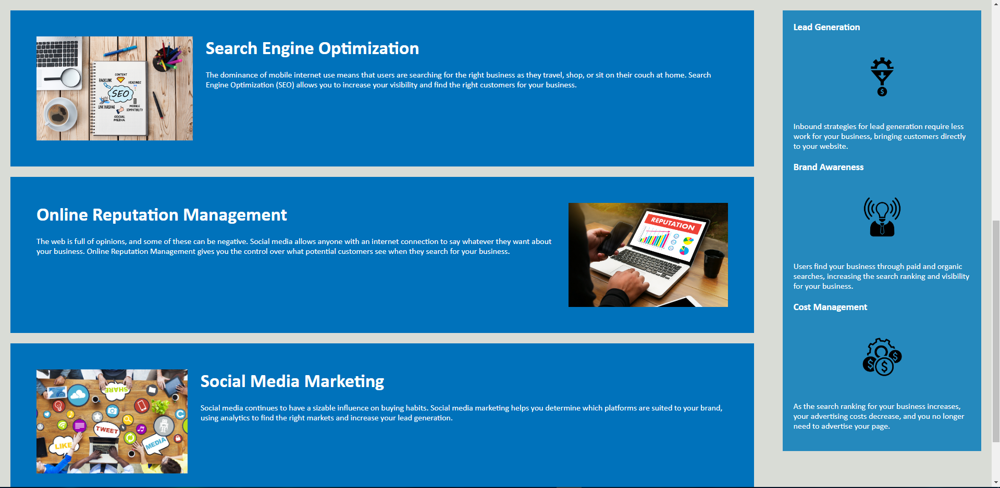

# Project Overview

This project is a mock website focused on improving the websites accessibility standards, and making it easier for future improvements to be made.

---

## Changelog

I added semantic html headers such as main, and nav to organize the flow of the code. As well as removed some unneccessary divs and other tags.  Consolidated a lot of css in order to remove repetitive and pointless code. As well as removed some tags that couldnt utilize classes.

---

### Tools Used
HTML, CSS

---

#### Website Images

---

##### Author Info

Made by: Greg Marzec  
[Github](https://github.com/gregmarz)